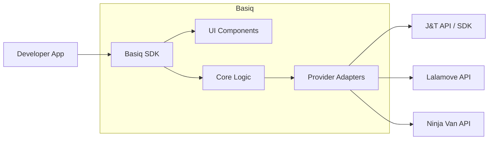
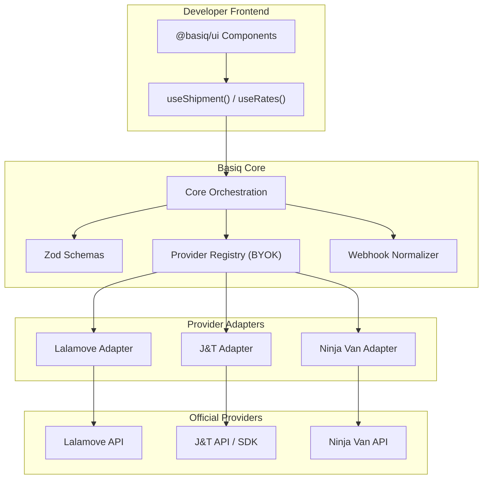

# Basiq

> Open-source infrastructure for standardizing Philippine logistics integrations.

Basiq is a universal logistics layer for the Philippines. It gives developers a single, consistent way to create shipments, fetch rates, track parcels, and integrate courier workflows without rewriting their app for every provider.

Instead of dealing with different payload shapes, status formats, and address requirements across each courier, developers integrate once through Basiq and plug in supported providers through a unified contract.

## Why Basiq?

Philippine logistics integrations are fragmented.

One provider may require city IDs, another may require latitude/longitude, and another may structure tracking and webhook events differently. Basiq solves this by providing:

- A standardized core for shipment creation, tracking, and rates
- A unified Philippine address model
- Provider adapters for official courier APIs and SDKs
- BYOK support so developers use their own provider credentials
- Optional UI components for building shipping flows faster

## Core Principles

- **Provider-driven** — Add or swap couriers without rewriting app logic
- **BYOK** — Bring your own API keys and keep direct courier relationships
- **PH-first** — Designed for Philippine addresses, mobile numbers, COD, and local logistics flows
- **Framework-friendly** — Core logic is framework-agnostic, with UI packages layered on top
- **Open-source** — Built to become shared infrastructure for PH developers

## Architecture



## How It Works

Basiq acts as the orchestration layer between a developer's app and multiple logistics providers.

- The developer calls one Basiq API
- Basiq validates the payload using shared schemas
- The registry resolves the active provider
- The adapter translates the request into the provider-specific format
- Responses and webhook events are normalized back into a shared Basiq shape

## System Design



## Planned Packages

```txt
packages/
  core/               # Standardized logic, schemas, errors, orchestration
  react/              # React hooks and bindings
  ui/                 # Address picker, rate cards, tracking timeline
  provider-lalamove/  # Lalamove adapter
  provider-jt/        # J&T adapter
  provider-ninjavan/  # Ninja Van adapter
  docs/               # Documentation site
```

## Planned Features

### Core
- Unified shipment creation API
- Rate fetching across supported providers
- Tracking normalization
- Standardized webhook events
- Provider capability detection
- Graceful degradation for unsupported provider features

### PH-first Validation
- Region → Province → City → Barangay address structure
- PSGC-backed geographic validation
- PH mobile number validation
- COD-aware payload support

### UI Components
- Smart Address Picker
- Tracking Timeline
- Rate Comparison Card
- Branded provider wrapper and theme support

## Bring Your Own Key

Basiq does not replace courier accounts.

Developers connect their own provider credentials so they can keep their direct commercial relationship, rates, and operational setup with each logistics partner.

## Planned Logistics Partners

Initial provider targets:

- Lalamove
- J&T Express
- Ninja Van

Future expansion may include:

- GrabExpress
- Transportify
- Flash Express
- LBC
- JRS
- 2GO

## Example Vision

A developer building a Shopify-like, Grab-like, or Shopee-like shipping flow should be able to:

- Install Basiq
- Register one or more providers
- Use a shared shipment schema
- Render UI components for address input and tracking
- Switch providers without rewriting product code

## Status

**Current status:** Draft / Planning

Basiq is currently being designed as an open-source standard layer for Philippine logistics infrastructure.

## Mission

To standardize the movement of Philippine logistics through open-source code.

## License

TBD
